# TP Docker — MySQL + Java App Server
## Datos del alumno
- Nombre: Cersosimo Vicente
## 1. ¿Qué es Docker?
... Docker es una plataforma de contenedores que permite empaquetar una aplicación junto con todas sus dependencias en una unidad estandarizada llamada contenedor.
## 2. Volúmenes en Docker
... Un volumen Docker es un mecanismo para persistir datos generados y utilizados por contenedores.
- Named Volumes: gestionados por Docker, recomendados para bases de datos.
- Bind Mounts: mapeo directo de un directorio del host.
- tmpfs Mounts: almacenamiento en memoria RAM (no persistente).

## 3. Redes en Docker
...
|Tipo | Descripción | Uso típico |
|-----|-------------|------------|
|bridge|Red privada aislada. Contenedores se comunican por nombre.|Desarrollo, microservicios
|host | El contenedor comparte la red del host directamente. |Alto rendimiento (Linux)
|none |Sin acceso a red. |Procesos batch aislados
|overlay| Red multi-host para Docker Swarm.| Producción distribuida

## 4. ¿Por qué Payara Server?
...Payara Server es la opción más recomendable porque:
- Es una distribución de GlassFish mantenida activamente con soporte de producción.
- Soporta Jakarta EE completo: JPA, EJB, JAX-RS, CDI, JMS, y más.
- Incluye Payara Admin Console, una consola de administración web (GUI) accesible en el puerto 4848.
- Tiene imágenes Docker oficiales optimizadas y actualizadas.
- Escala bien de desarrollo a producción sin cambiar el stack tecnológico.

## 5. Explicación del docker-compose.yml
... El docker-compose.yml es un archivo de configuración en formato YAML que permite definir y ejecutar aplicaciones multi-contenedor de forma orquestada.
## 6. Explicación del init.sql
... El archivo init.sql es un script de inicialización que se utiliza para configurar automáticamente una base de datos en el momento en que se crea el contenedor por primera vez.
## 7. Dificultades y soluciones
... 

# Capturas de Pantalla Obligatorias

## **Parte 1 — Infraestructura Docker**

## 1. Salida de docker --version y docker info en la terminal
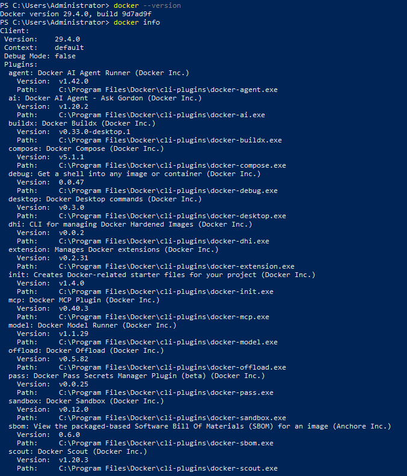
## 2. Salida de docker network ls mostrando la red java-net
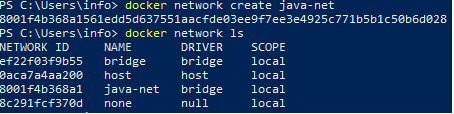
## 3. Salida de docker volume inspect mysql-data
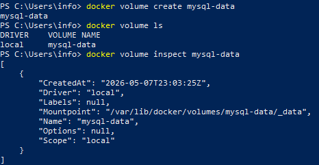
## 4. Salida de docker ps con ambos contenedores activos
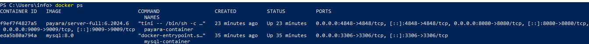
## 5. docker network inspect java-net con ambos contenedores en la red
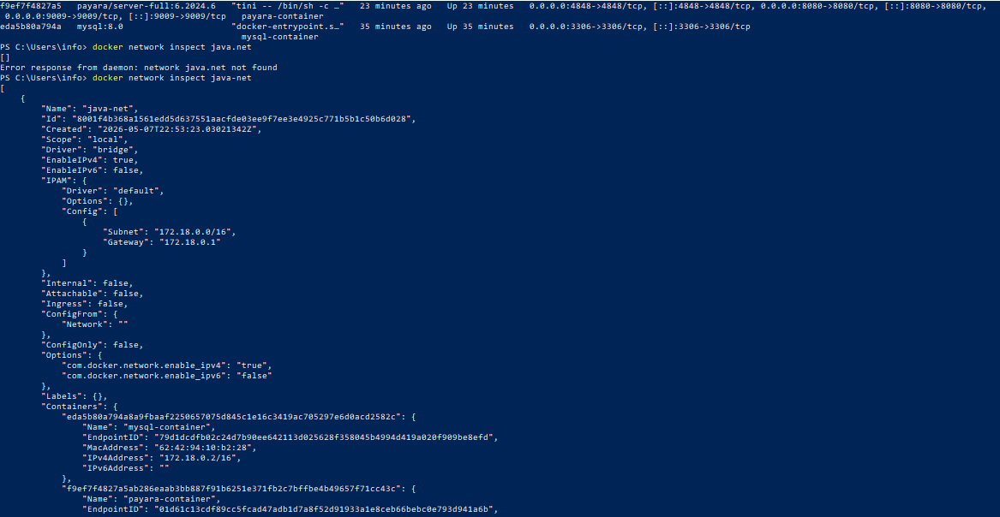

## **Parte 2 — MySQL (3 capturas)**
## 6. Logs de MySQL mostrando: ready for connections
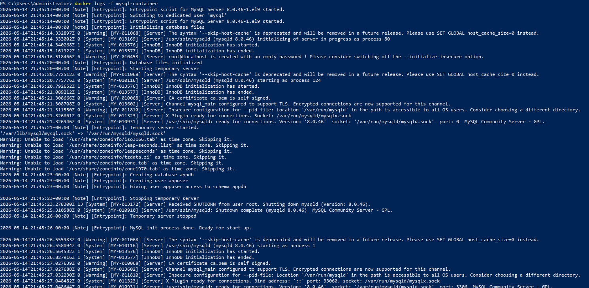
## 7. Salida de SHOW DATABASES; mostrando la base appdb
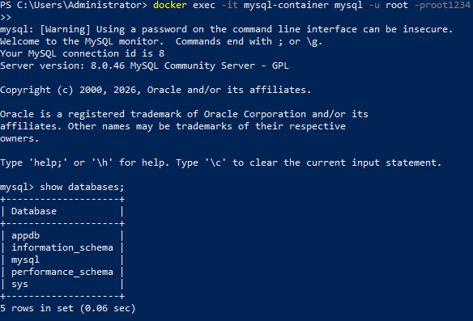
## 8. Salida de SELECT * FROM usuarios; con los datos del init.sql

## **Parte 3 — Payara Admin Console / GUI (5 capturas)**
## 9. Pantalla de login de Admin Console en http://localhost:4848
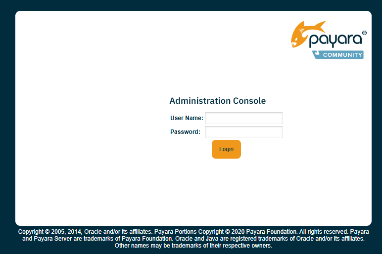
## 10. Dashboard principal de Payara tras iniciar sesión
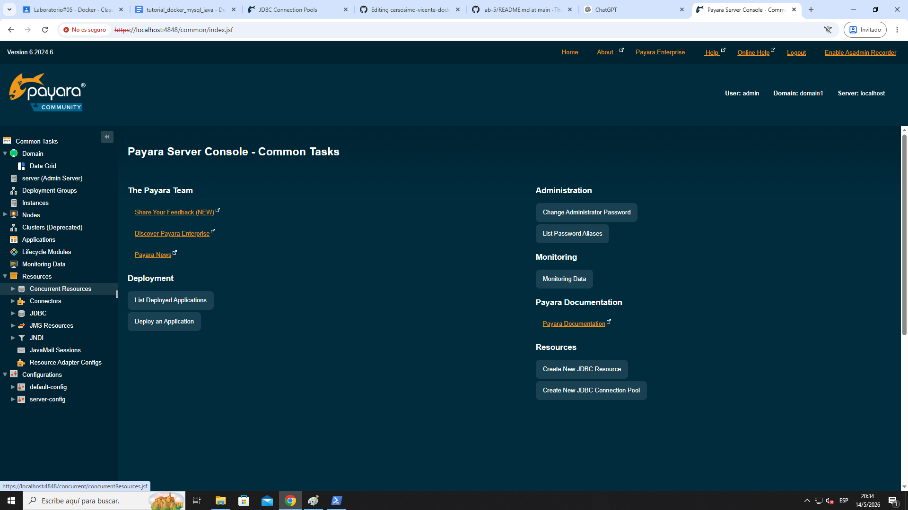
## 11. Pantalla del Connection Pool MySQLPool creado
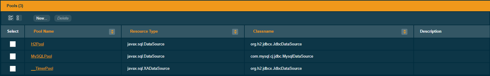
## 12. Resultado del botón Ping mostrando conexión exitosa a MySQL
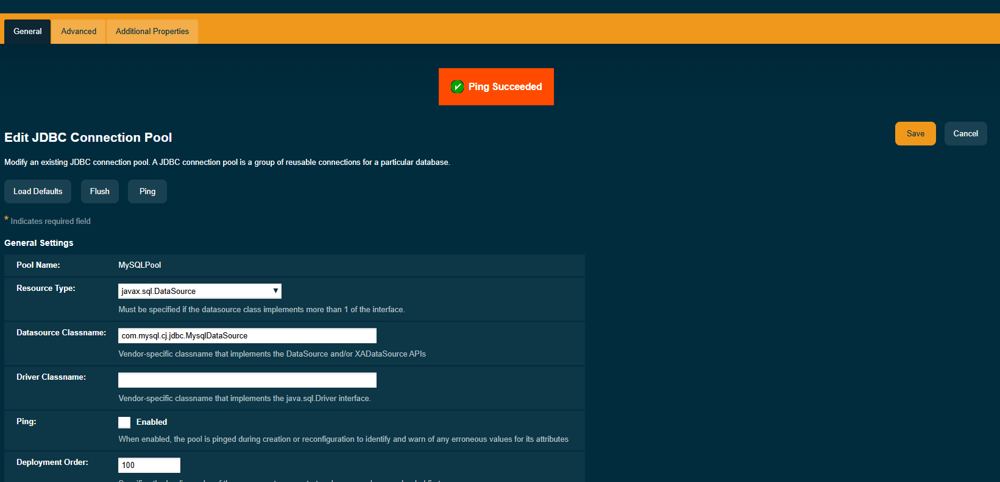
## 13. JDBC Resource jdbc/MySQLDS visible en la consola
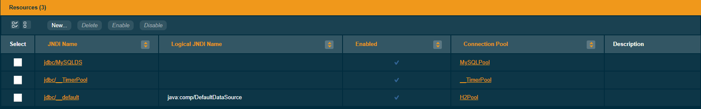

## Parte 4 — Conectividad entre contenedores (1 captura)
## 14. Salida del ping de Payara hacia mysql-container desde la terminal

